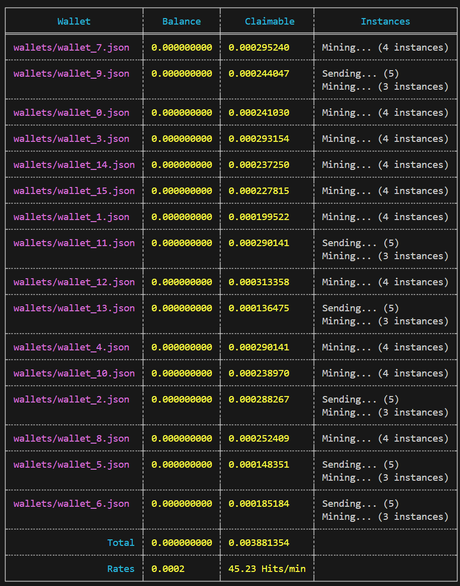

# ORE Dashboard

This utility automates the mining of ORE on Solana and provides a real-time dashboard for monitoring the mining operations.

## Installation

### Prerequisites
Install Rust and Cargo:

```bash
curl https://sh.rustup.rs -sSf | sh
```

### Solana CLI
Install the Solana CLI:

```bash
sh -c "$(curl -sSfL https://release.solana.com/v1.18.4/install)"
```

### Ore CLI
Install the Ore CLI for mining:

```bash
cargo install ore-cli
```

## Configuration
Place wallet JSON files in the `wallets` directory with `.json` extensions.

## Running the Utility
Start the mining operation:

```bash
cargo run --release
```

The application will distribute RPC calls across provided URLs and update the dashboard with mining statuses.

## Dashboard
The dashboard displays:
- **Wallet Path**
- **Balance** in ORE
- **Claimable** ORE
- **Mining Instance Status**

